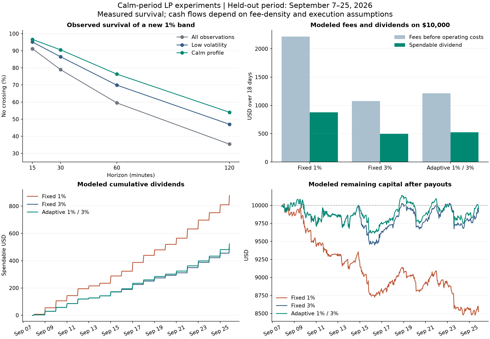
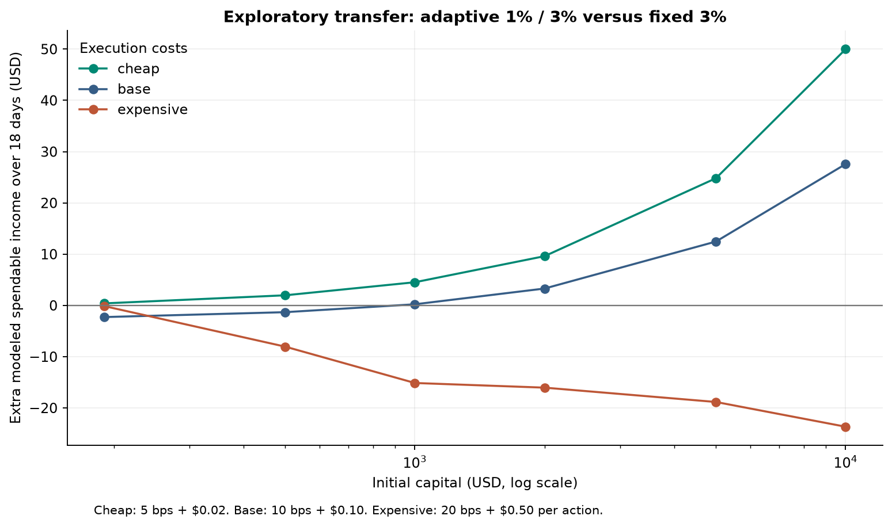

Research result, 2026-09-25.

Calm periods improved the survival of a 1% band in the held-out sample.
A simple volatility-driven policy also increased modeled dividends on $10,000, compared with a fixed 3% band.
The base-case increase was 5.6%. The interval for extra daily dividends on complete days included zero.
Cheap execution made the same policy slightly beneficial at $190.
Adding the tested velocity and survival rules did not improve dividends over the fixed 3% baseline.

These findings support further research on selective narrowing. They do not establish a dependable live APR.

**The experiment uses your income objective.**

The account pays operating costs from fees, distributes half the remaining fees, and reinvests half.
Spendable income is the primary result. Remaining capital is a separate result.
The experiment does not require the strategy to beat holding SOL.

The primary selection uses two illustrative constraints: ending capital at least 95% of its initial value, and capital drawdown below 15%.
These are research assumptions, not limits that you specified.
The tables also show the permanently narrow policy, which produced more income but failed those constraints during validation.

**Data and experimental separation.**

I archived 25,919 consecutive five-minute candles for Orca SOL/USDC.
The sample runs from June 27, 20:25 UTC through September 25, 20:15 UTC.
The calculation excludes the newest candle from the first API response.
It does not fill missing observations. The final dataset has no missing five-minute intervals.

The first 60% supplies model estimates and thresholds.
Validation runs from August 20 to September 7.
The final test runs from September 7, 20:20 UTC through September 25, 20:15 UTC, approximately 18 days.

The candidate set contains 26 policies.
The selected policies and implementation hashes were saved before the test evaluation.
The later capital-size comparison is explicitly exploratory. It transfers an already selected policy without changing its parameters.

There were 372 cash-flow replays: 104 primary replays, 232 sensitivity replays, and 36 exploratory capital-transfer replays.
Seven checks passed for accounting, the 50/50 split, execution timing, CLMM inventory, and protection against future-data leakage.

Some test dates overlap the earlier hourly descriptive audit.
The new policy selection did not use these test outcomes.
This is a chronological historical evaluation, not a prospective live trial.

**Experiment 1: does calmness improve short survival?**

Volatility is an EWMA of squared five-minute log returns, with a one-hour half-life.
The volatility threshold is the training sample's 40th percentile: 0.1527% per five-minute return.
Velocity measures the change in log volatility over 30 minutes, expressed per hour.
The calm profile also requires low absolute velocity and low variability of changes in volatility.
All thresholds come from the training data.

Each hypothetical band uses boundaries P/1.01 and P*1.01.
That means an upper distance of 1% and a lower distance of approximately 0.99%.
Future candle highs and lows determine crossings.

| Horizon | Survival across all conditions | Survival during low volatility | Survival with the full calm profile |
|---|---:|---:|---:|
| 15 minutes | 91.20% | 95.14% | 96.62% |
| 30 minutes | 78.97% | 86.49% | 90.54% |
| 60 minutes | 59.51% | 69.91% | 76.35% |
| 120 minutes | 35.43% | 47.03% | 54.05% |

The full calm profile has 148 qualifying origins across 11 days.
These origins form 50 contiguous spells and overlap in their future observations.
They are not 148 independent trials.

At 30 minutes, the exit rate was 9.46% during calm conditions and approximately 21.45% outside them.
A daily-block bootstrap gave a 95% interval of approximately -18.9 to -1.2 percentage points for this difference.
This is pointwise descriptive evidence. It does not include a correction for every comparison in the suite.

The observation supports your central hypothesis: conditional calmness can create useful periods for a 1% band.

**A useful distinction emerged: band survival and calm-period duration differ.**

The strict calm detector's median uninterrupted spell lasted 10 minutes. Its longest spell lasted 45 minutes.
The detector can cease to classify conditions as calm while price remains within the band.
A controller that widens after every classification change can therefore trade more often than necessary.

The tested controller required a 30-minute minimum dwell, except after a price exit.
That dwell and the fragmented signal did not form a good combination.
This finding concerns this detector and controller. It does not establish that calm market conditions generally last only 10 minutes.

A better next experiment should estimate whether favorable conditions will persist long enough to repay a complete transition.
It should also test hysteresis that retains a narrow band while its economics remain favorable.
Those changes need new evaluation. I did not tune them on the final test.

**Experiment 2: is the survival forecast accurate enough?**

I compared three forecasts: unconditional historical frequency, volatility-scaled historical excursions, and volatility-scaled excursions conditioned on velocity.
A smaller Brier score indicates a smaller mean squared probability error.

| Horizon | Unconditional | Volatility | Volatility plus velocity |
|---|---:|---:|---:|
| 15 minutes | 0.08426 | 0.09851 | 0.09780 |
| 30 minutes | 0.18738 | 0.18755 | 0.18672 |
| 60 minutes | 0.30283 | 0.25717 | 0.25658 |
| 120 minutes | 0.32130 | 0.24699 | 0.24992 |

Volatility scaling helped at longer horizons. Velocity added little and worsened the two-hour score.
The forecast was poorly calibrated in the low-risk group.
For 30-minute forecasts below 5%, the velocity-conditioned model predicted 2.86% average risk but observed 12.99% exits across 485 origins.

Thus, a displayed 95% survival estimate from this model is not yet a reliable operating guarantee.
The profile detects useful conditions, but the particular probability estimator still needs calibration.
The result does not show that survival analysis itself is unsuitable.

**Experiment 3: does selective narrowing produce more income?**

The base scenario uses:

- Initial capital of $190 or $10,000.
- A swap cost of 10 basis points on the actual estimated rebalancing notional.
- A fixed $0.10 cost per close/open cycle and per fee-settlement action.
- Five minutes of decision latency, followed by five minutes without LP fees during a move.
- Daily fee settlement, with operating-cost recovery before the 50/50 split.
- Outward rounding of band boundaries to the pool's four-tick spacing.
- No fees from a candle that crosses either boundary, as the conservative attribution case.

A fixed-width policy recenters after an observed exit. It does not retain the original band indefinitely.
The adaptive policies alternate between 1% and a wider band.

Validation selected the fixed 3% policy for $190.
For $10,000, validation selected the volatility-only policy that alternates between 1% and 3%.
The more complex profile and survival policies were not selected.

The following are modeled results over the final 18 days.

| Policy on $10,000 | Spendable income | Reinvested net fees | Remaining capital | Rebalances |
|---|---:|---:|---:|---:|
| Fixed 1% | $877.86 | $877.86 | $8,523.03 | 112 |
| Fixed 3% | $495.57 | $495.57 | $9,904.38 | 17 |
| Fixed 5% | $321.95 | $321.95 | $10,135.05 | 7 |
| Clock-based 1% / 3% | $559.58 | $559.58 | $9,531.52 | 99 |
| Volatility-based 1% / 3% | $523.14 | $523.14 | $9,951.20 | 73 |
| Full-profile 1% / 3% | $472.73 | $472.73 | $9,670.91 | 76 |
| Survival-based 1% / 3%, 30-minute horizon, 5% entry limit | $481.16 | $481.16 | $9,810.80 | 74 |

Against fixed 3%, the selected adaptive policy earned $139.57 more gross LP fees.
It incurred $84.42 more operating costs.
After the 50/50 split, spendable income increased by $27.57, or 5.6%.
Remaining capital also increased by $46.82 relative to that baseline.

A paired bootstrap of two-day blocks gave an interval of approximately -$0.05 to +$1.55 for extra daily dividends.
That comparison uses 17 complete days and excludes partial boundary days.
The interval includes zero. The estimated benefit is promising but not established as repeatable.

The fixed 1% policy paid more, but its remaining capital fell substantially.
It is shown because spendable income and capital retention are distinct choices in your objective.
The fixed 5% policy retained more capital but paid less.
The experiment does not hide either tradeoff inside a single return number.

| Policy on $190 | Spendable income | Reinvested net fees | Remaining capital | Rebalances |
|---|---:|---:|---:|---:|
| Fixed 1% | $9.94 | $9.94 | $155.94 | 112 |
| Fixed 3% | $7.57 | $7.57 | $186.37 | 17 |
| Fixed 5% | $4.83 | $4.83 | $191.25 | 7 |
| Volatility-based 1% / 3% | $5.29 | $5.29 | $184.48 | 73 |
| Full-profile 1% / 3% | $4.25 | $4.25 | $178.97 | 76 |

At $190, the same volatility policy loses $2.27 of spendable income against fixed 3% in the base scenario.
The cost-gated adaptive policy selected for this balance never narrowed in the base test.
It therefore reproduced the fixed 3% result.
Its deliberately conservative transition estimate rejected all entries.
That result does not prove that every narrow-band opportunity was unprofitable.

**Experiment 4: does cheap execution change the result?**

Yes. The result changes with execution cost and fee density.

| Scenario on $10,000 | Adaptive spendable income | Fixed 3% spendable income | Adaptive difference |
|---|---:|---:|---:|
| Cheap: 5 bps and $0.02 | $567.68 | $517.69 | +$49.99 |
| Base: 10 bps and $0.10 | $523.14 | $495.57 | +$27.57 |
| Expensive: 20 bps and $0.50 | $423.24 | $446.90 | -$23.67 |
| Half the modeled fee density | $216.62 | $223.97 | -$7.35 |
| Twice the modeled fee density | $1,163.04 | $1,059.94 | +$103.10 |
| Fifteen minutes of downtime | $494.38 | $490.25 | +$4.14 |

The adaptive policy improved dividends in 18 of 27 cost/fee-density combinations.
Those combinations reuse the same price path. They are sensitivity cases, not 27 independent experiments.

The exploratory transfer uses the same selected volatility policy at different balances.
It does not refit the policy.

| Initial capital | Extra income with cheap execution | Extra income with base execution |
|---|---:|---:|
| $190 | +$0.39 | -$2.27 |
| $500 | +$1.97 | -$1.32 |
| $1,000 | +$4.52 | +$0.22 |
| $2,000 | +$9.61 | +$3.29 |
| $5,000 | +$24.81 | +$12.46 |
| $10,000 | +$49.99 | +$27.57 |

In this sample, the base-cost crossover falls between $500 and $1,000.
This is not a universal minimum balance.
The $190 result under cheap execution directly supports testing your claim that cheap switching can make the cycle viable.

**Time of day helps less than current conditions.**

Training identified 05:00 and 07:00–11:00 UTC as the six lowest-volatility hours.
The clock-based policy uses those hours without assuming a local timezone.
Its 30-minute 1% band exit rate in the test was 17.52%, compared with 21.03% overall.
The full calm profile achieved 9.46%.

Mean trailing hourly pool volume was approximately $5.44 million overall and $2.90 million during the full calm profile.
Calm periods retained substantial volume in this sample.
The strategy needs that combination: limited price movement and sufficient fee-generating trades.

The clock policy paid more than fixed 3% on $10,000, but retained less capital and made 99 rebalances.
It was not the validation-selected policy.
The result favors using time of day as supporting information instead of using it as the only trigger.

**What the fee numbers establish.**

The price and volume observations are historical.
The pool's historical active-liquidity distribution is unavailable.
I therefore used a constant TVL and concentration scenario anchored to a current public snapshot:
TVL $27.11 million, implied concentration 17.54, and a 0.04% swap fee.

The snapshot reports a 13% protocol share, leaving 87% of swap fees for LPs.
Orca's source defines the protocol-fee denominator as 10,000. [Source](https://github.com/orca-so/whirlpools/blob/main/programs/whirlpool/src/math/token_math.rs).

The fee model uses position liquidity divided by total assumed active liquidity, including the proposed position.
Fees enter a quote-currency reserve. The data does not reveal their actual token composition.
Settlement costs include the modeled conversion required for reinvestment.
The model does not reconstruct historical routes, failures, fee-token price exposure, or counterfactual trader behavior.

As a sensitivity check, a close-based fee estimate raises the adaptive payout to $552.89 and fixed 3% to $510.29 on $10,000.
That estimate credits entire candles when the close is inside the band.
The difference shows why trade-level fee attribution matters.

The inventory calculations follow CLMM equations. [Source](https://app.uniswap.org/whitepaper-v3.pdf).
The experiment does not measure cross-venue migration gains.
It does not estimate a future annual return from 18 days.
The CSV files include linear APR equivalents for comparison, with no forecast interpretation.

**The next research decision.**

Continue with selective narrowing. Keep the simple volatility policy as the main candidate.
Do not assume that the tested velocity and survival filters improve income merely because they use more information.

The next experiment should make three changes:

1. Estimate the duration of favorable conditions and the time needed to repay a complete transition.
2. Calibrate survival probabilities on recent data, with separate checks for low predicted risk.
3. Record actual liquidity, fee growth, swap quotes, and execution time to replace the largest economic assumptions.

Run those changes in observation mode first.
Measure actual fee income and execution costs against the archived research predictions.
No live strategy or trading configuration changed during these experiments.

The [protocol](PROTOCOL.md), [raw-data manifest](data/manifest.json), [policy selection](results/selection.json), and [complete test table](results/test.csv) accompany this report.
The [sensitivity table](results/sensitivity.csv) and [exploratory balance comparison](results/exploratory_capital_transfer.csv) preserve all reported scenarios.
